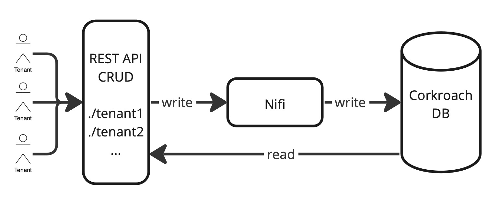

1. ....
    - Application domain: travel and accommodation. The data platform is used by tenants who upload AirBnB to our platform to perform different analysis
    - Generic types of data:
        + Structured csv table storing information of AirBnB listing from different cities
        + GeoJSON describing neighborhoods around the city  
    - Assumption about tenant data source:
        + Quite constant data without too much changes or updates. Updates and changes happens on at most in a yearly basis
        + Tenant get data from source by downloading them from the page??? and use our API transfer the data to our platform
    - Under which situations/assumptions that the platform serves for big data workload 
        + ??? 
2. ... 

    - 
    - Data from source can be ingested by the API. For each tenant, we can have a dedicated directory to temporarily store the input files from users from a tenant. Once the pipeline is trigger, the file will be ingested by Nifi (fetch , ??? , put) and transfer to fit the database schema, and inject to database 

    - Explain which would be the third parties (services/ infrastructure) that you do not develop for your platform ??? 

3. Corkroach DB is used in our use case. By default, each node has a replication factor of 3, meaning if a node fails, there are 2 other ndoes storing the same information. Furthermore, each cluster can be backed up ???

4. 