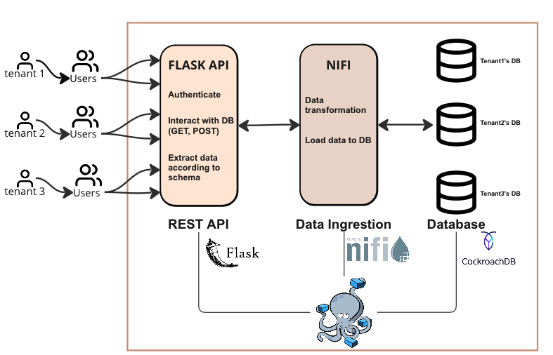

<b>PART 1 - Design</b>

<u>1. Explain your choice of the application domain and generic types of data to be supported and technologies for mysimbdp-coredms. Explain your assumption about the tenant data sources and how one could get data from the sources. Explain under which situations/assumptions, your platform serves for big data workload.</u>

    - I chose to design a dataplatform for the application domain of travel and accommodation marketplace. In general, the data are scrapped from accommodation rental platforms site (e.g., AirBnB, Booking.com, Expedia), including listing information within a location (specific city within a country), location geo-data, user reviews, prices and availability of each listing for a specific time. The raw data can stored as csv tables or json files. The data types can be string, numerical data (interger and float), date-time, boolean and geometry. In general, the data used in accomodation marketplace domain can be both structured (e.g., listing summary, host details, location, price calender) and unstructured (e.g., images). However, I make an assumption here that the data platform is more focused on structured data and the relationship between the data tables (listing, review, price, and so one) can be easily established. Thus, SQL databases would be a suitable option for mysimbdp-coredms. Among the suggested database, CockroachDB is chosen because it is built on top of PostgreSQL with a strong support for horizontal scaling. 
    
    - I made a couple of assumptions about tenant data source:
        + The data source of tenants mostly contains web scrapped data from AirBnB and similar platforms (e.g., Booking.com). The data can come from a public dataset such as the one given in this assignment or from their own in-house scrapper. The data can also comes from access to third-party API or external databases. 

        + Data format: .csv, .json, e.g.

        + Furthermore, tenants store the scrapped data in local machines (temporarily for a short period of time), in their own databases, or S3 buckets. 
        
    - One can get the data from source by uploading it to our mysimbdp-coredms though the API interface (mysimbdp-daas). External database connection can be directly imported to the data ingrestion pipeline (mysimbdp-dataingest). Furthermore, the data ingrestion pipeline can also be connected to platform like Kafka to ingres data from messaging systems for real-time updates if tenants require. 

    - The platform can serve big data workflows in situations when there are multiple tenants using the platform to write and read large volume of data (large volume). Providing that most tenants of our platforms are hotel chains or software providers who want to collect and analysize listing data for a specific location or worldwide accomodation market, we are looking at a potentially large amount of daily updates of availabilities and prices that need to be processed, stored and provisioned in our coredms (quick processing time). Besides the potentially large write request, tenants and their internal users might make multiple read requests to our coredms. In this potential scenario, the coredms needs to be scaled to handle big data workflow (scalability).
        
    In more concrete terms, the toy dataset I used for development is around 79 MB and it contains compressed AirBnB listing data of Amsterdam in 2023. The website where I got the sample data share over 500 similar datasets and the data is updated every 3 months. Thus, one can collect over 150 GB (79 * 500 * 4) of data a year just from this public repository. Depending on the use case, the frequency of database updates can increase to daily for some tenants, thus, require a platform capable of processing and storing these data. 
        
<u>2. Design and explain the interactions among main platform components in your architecture of mysimbdp. Explain how would the data from the sources will be ingested into the platform. Explain which would be the third parties (services/infrastructures) that you do not develop for your platform. </u>

    
    - The whole platform is packaged in a docker-compose that can be deployed locally or to different cloud services. The platform includes this components:
        a. mysimbdp-daas (Flask API):
            + Responsible for writing and reading data from tenants' users (data producers/consumers). 
            + Regarding to writing data, user can send POST requests to upload data files to the API. The API temporarily stores the raw files to mitigate data loss risks resulting from potential failures in other processes. For the time being, the API extracts relevant attributes from the raw data, creating CSV tables with schemas matching the predetermined data models. Once the data is extracted, the next component, mysimbdp-dataingest, will automatically pick up the file to transform and load to mysimbdp-coredms.
            + Regarding reading data, user can utilize HTTP GET requests to the API, triggering the execution of queries directly through a connection to mysimbdp-coredms, and retrieving the query result via the API.

        b. mysimbdp-dataingest (Nifi):
            + Responsible for fetching data from different sources. In the current design, Nifi fetches processed data files stored in a shared volume to transform to sql statements and load the data to mysimbdp-coredms.
            + Validate the data before loading them to mysimbdp-coredms.
            + The data ingrestion pipeline can be run in parallel to increase the ingrestion speed. 

        c. mysimbdp-coredms (Cockroach DB):
            + Have connect to both the Nifi pipeline and Flask API to for writing and reading data, respectively. 
    
    - The current design is restricted to read data (csv and json files) uploaded by users directly to the API. Once users have uploaded the data, the API can extracts relevant attributes, create data files matching the pre-determined database table schemas, and saved it to a destination folder with specific naming templates. Depending on the names, Nifi can automatically pick up the file and run correct pipeline to load data to the correct database table for a specific tenant in mysimbdp-coredms.
    
    - The platform is not designed for reading data from external databases that tenants can have connection too. It also can't read data from messaging platforms.

<u> 3. Explain a configuration of a cluster of nodes for mysimbdp-coredms so that you prevent a single-point-of-failure problem for mysimbdp-coredms for your tenants.</u>

For a cluster of nodes, we need to deploy at least three nodes to ensure redundancy and fault tolerance. Thus, I use a three-node cluster as a sample configuration to prevent a single-point-of-failure problem for mysimbdp-coredms. Assuming that a majority data producers and consumers locate in Europe, I can use CockroachDB GCP cloud regions locating in Europe, specifically europe-north1 (Hamina), europe-west3 (Frankfurt), and europe-central2 (Warsaw) to initialize db nodes. Each node is an instance of CockroachDB, and they can be joined with one another so that all 3 nodes inside a cluster can communicate with one another and agree on the current state of the database even if some of them are temporarily disconnected.

<u> 4. You decide a pre-defined level of data replication for your tenants/customers. Explain the level of replication in your design, how many nodes are needed in the deployment of mysimbdp-coredms for your choice so that this component can work property (e.g., the system still supports redundancy in the case of a failure of a node).</u>

For the deployment of mysimbdp-coredms, the pre-defined level of data replication for tenants/customers can be 3, which is the default replication factor of CockroachDB (for both node replication and range replication). Using the default level of data replication is suitable for my platform because I assume that a majority of tenants and their data workload locates around Europe. This assumption means that having multiple nodes locating in different locations within Europe helps minimize the impact of regional failures and ensures that tenants in different parts of Europe can access the database with lower latencies. The replication level is limited to three because data in the chosen domain is not sensitive (not require strong consistency), and three replica is suffice for maintaining fault tolerance and data availability if any or 2 nodes become unavailable. 

<u>  5. Consider the platform data center, the tenant data source locations and the network between them. Explain where would you deploy mysimbdp-dataingest to allow your tenants using mysimbdp- dataingest to push data into mysimbdp, based on which assumptions you have. Explain the performance pros and cons of the deployment place, given the posibilities you have. </u>

Using the same tenant location assumption and locations of db nodes mentioned previously in (3) and (4), the mysimbdp-dataingest can be deployed in the same locations where database nodes locate. The advantage of this design choice include low latency (deploying nifi in the same neywork as database reduce metwork latency), improving throughput and simplify network configuration between these components. On the other hand, the disadvantages of this choice includes high latency for tenants locating further away from the chosen data centers. Furthermore, there is a risk of a single point of failure in case the data center where both the database node and ingrestion pipeline fails, leading to missing data being processed within the failed ingrestion pipeline.