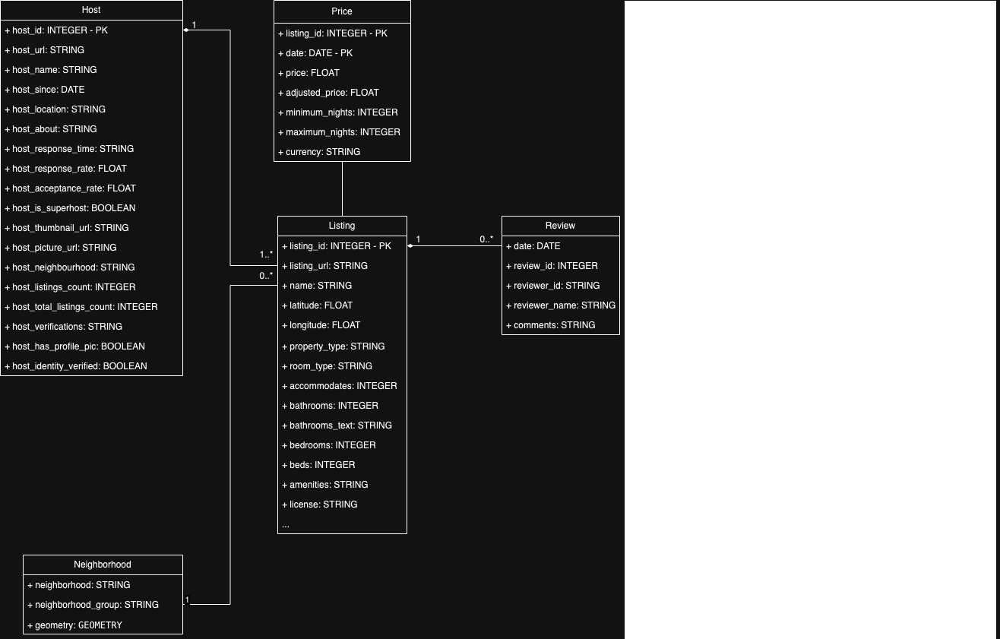

<b>Part 2 - Implementation</b>

<u>1. Design, implement and explain one example of the data schema/structure for a tenant whose data will be stored into mysimbdp-coredms.</u>

- I chose the AirBnB listing dataset as the sample data, upon which I construct an SQL data schema for a tenant. The sample data is store in a <a href = "../data/"> data/ </a> directory. The sample data covers AirBnB listings for Amsterdam. The folder includes data dictionary, which explains data attributes. The data schema is constructed using data from: 
    + listings.csv.gz: contains majority of attributes each listing has.
    + calendar.csv.gz: contains listing prices for each listing each day of 2023
    + reviews.csv.gz: contains all reviews for listings in Amsterdam
    + neighbourhoods.geojson: contains geometric coordinates of neighborhoods in Amsterdam

- From exploring the data sample, I constructed a UML diagram for the data schema (not all attributes are included in the UML) 

    

    The SQL implementation of the above UML can be found in this file <a href = "../code/corkroachdb/airbnb_db.sql"> ../code/corkroachdb/airbnb_db.sql </a>. Notice that foreign key constraints are commented out in order to relax on this constraints for testing.

<u>2. Given the data schema/structure of the tenant (Part 2, Point 1), design a strategy for data partitioning/sharding, explain the goal of the strategy (performance, data regulation and/or what), and explain your implementation for data partitioning/sharding together with your design for replication in Part 1, Point 4, in mysimbdp-coredms.</u>

- Given the database schema and the application domain, I would use geo sharding with each shard contains data where listing location (neighbourhood or city) can be mapped to a specific region. The main goal of this stragegy is to improve performance of the database. Using the same assumption made in Part 1, Point 4, geo sharding has the advantage of faster data retrieving speed within Europe, where the db nodes and workloads are located. Geo sharding also help with  data regulation compliance. 

- As I previously set the replication factor to three, a copy of each shard is stored in a node, which is then replicated across the three default nodes within a cluster.

<u>3. Assume that you are the tenant, emulate the data sources with the real selected dataset and write a mysimbdp-dataingest that takes data from your selected sources and stores the data into mysimbdp-coredms. Explain what would be the atomic data element/unit to be stored. Explain possible consistency options for writing data in your mysimdbp-dataingest.</u>

- The atomic data unit is a row of the data table. For example, the listing table contains many rows storing individual listing. The atomic data unit for this table can be a row which includes attributes such as listing_id, listing_name, neighborhood, etc.

- According the CockroachDB <a href = "https://www.cockroachlabs.com/docs/v23.2/architecture/overview#consistency"> website </a>, it uses consistency in terms of both ACID and CAP theorem and it provides strong consistency. For transactions, CockroachDB supports ACID, meaning every node within a cluster of nodes returns data reflecting the same state. For writing data into the database, CockroachDb follows the Ralf consensus algorithm, which guarantees that any majority of replicas together always agree on whether an update (write) was committed successfully. Specifically, updates or writes must achieve consensus among a majority of replicas (2 out of 3 by default) before they are considered committed.

<u>4. Given your deployment environment, measure and show the performance (e.g., response time, throughputs, and failure) of the tests for 1,5, 10, .., n of concurrent mysimbdp-dataingest writing data into mysimbdp-coredms with different speeds/velocities together with the change of the number of nodes of mysimbdp-coredms. Indicate any performance differences due to the choice of consistency options.</u>

<u>5. Observing the performance and failure problems when you push a lot of data into mysimbdp-coredms (you do not need to worry about duplicated data in mysimbdp), propose the change of your deployment to avoid such problems (or explain why you do not have any problem with your deployment). </u>

Scaling Resources:

    Issue: Inadequate resources can lead to performance bottlenecks.
    Solution: Scale the resources of mysimbdp-coredms components, such as increasing the number of nodes, allocating more CPU and memory resources, and optimizing storage configurations.

Batch Processing:

    Issue: Processing data in small batches may lead to increased latency.
    Solution: Optimize data processing by implementing batch processing techniques. Instead of inserting data row by row, consider bulk inserts or batch commits to improve efficiency.

Failure Recovery and Redundancy:

    Issue: Single points of failure can lead to downtime and data loss.
    Solution: Enhance the system's fault tolerance by implementing mechanisms for automatic failure recovery. Ensure data redundancy and backup strategies are in place to prevent data loss.