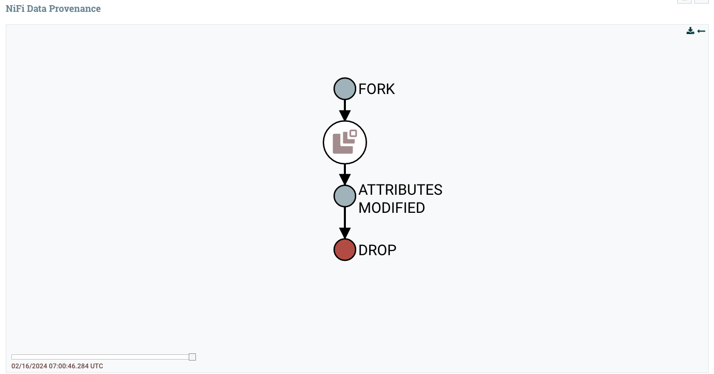

<b>Part 3 - Extension</b>

<u>1. Using your mysimdbp-coredms, a single tenant can run mysimbdp-dataingest to create many different databases/datasets. The tenant would like to record basic lineage of the ingested data, explain what types of metadata about data lineage you would like to support and how would you do this. Provide one example of a lineage data.</u>

Because mysimbdp-dataingest is built with Nifi, the pipeline already record basic lineage of ingrested data within Nifi in its Provenance Repository, where the history of each FlowFile is stored. The Nifi data lineage for a Flowfile records events occurring to the files such as FlowFile is created, forked, cloned, modified, etc. The metadata Nifi stores includes also FlowFile’s attributes (path, createdAt, modifiedAt, owner, permission, etc.) and the pointer to the FlowFile’s content (e.g., input claim and output) and aggregates that with the FlowFile’s state (such as its relationship with other provenance events). The following images shows a sample of data lineage of a flow file recorded by Nifi during testing. The FORK event is recorded for split text component, following by ATTRIBUTES_MODIFIED when converting csv to json, and finally the flow file is dropped due to failure in converting csv to json.  

Therefore, the current implementation is already capable of reporting data lineage reported by Nifi. 

<u>4. Assume that now only mysimbdp-daas can read and write data into mysimbdp-coredms, how would you change your mysimbdp-dataingest (in Part 2) to work with mysimbdp-daas?</u> 

If only mysimbdp-daas is allowed to read and write data into mysimbdp-coredms, the location of API and ingrestion pipeline in Part 2 should be switched so that tenants sends data directly to mysimbdp-dataingest pipeline, which ingres and process the data, before sending it to the API for making a read and write request into mysimbdp-coredms. The modified mysimbdp-dataingest workflow can be as follow:

    - Data Ingestion Process: instead of directly interacting with mysimbdp-coredms, mysimbdp-dataingest will extract, process and transform data from data source before sending the output data to mysimbdp-daas.

    - API Calls to mysimbdp-daas: mysimbdp-dataingest will make API calls to mysimbdp-daas to submit the prepared data for ingestion.

    - Handling Responses: mysimbdp-dataingest will incorporate workflow to handle responses from mysimbdp-daas to ensure successful ingestion or handle any errors.

<u>5. Assume that the platform allows the customer to define which types of data (and) that should be stored in a hot space and which should be stored in a cold space in the mysimbdp-coredms. Provide one example of constraints based on characteristics of data for data in a hot space vs in a cold space. Explain how would you support automatically moving/extracting data from a hot space to a cold space.</u>

An example of constraint based on characteristics of data can be:

- Hot Space:
    + Characteristics: frequent access, recent data (e.g., last 7 days), high query performance required

- Cold Space:
    + Characteristics: infrequent access, historical data (e.g., older than 7 days), lower query performance acceptable

To support automatic data moving/extracting from a hot space to a cold space, these processes can be implemented:
- Define Lifecycle Policies: allow customers to define policies specifying the criteria for moving data from hot to cold. For example, a policy could state that data older than 7 days should be moved to the cold space.
- Metadata Tagging: tag each piece of data with metadata indicating its characteristics, such as the creation timestamp or frequency of access.
- Periodic Evaluation: regularly evaluate the data based on the defined policies to identify data that meets the criteria for moving to the cold space.